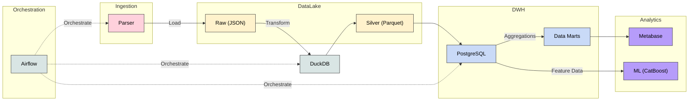

# 🏠 Moscow Flats Pipeline

Пайплайн для сбора, хранения и аналитики рынка недвижимости Москвы.
Обеспечивает полный цикл обработки данных: от парсинга объявлений до построения витрин и обучения ML-модели для оценки стоимости квадратного метра.

> **Примечание:** В ветке `main` содержится ядро системы: ETL-процессы, DWH и инфраструктура. Реализация пользовательского интерфейса и API для инференса модели в ветке `api-frontend`.

## 🛠️ Основной стек
* **Оркестрация:** AirFlow
* **Хранилище:** PostgreSQL (DWH), S3 (MinIO)
* **Compute:** DuckDB
* **Контейнеризация:** Docker, Docker Compose
* **BI:** MetaBase
* **ML:** CatBoost


## 🐍 Используемые Python библиотеки
* `logging`
* `datetime`, `pendulum`
* `json`
* `duckdb`, `pandas`
* `playwright`
* `boto3`

## Архитектура данных
Используется Medallion Architecture

* Raw (S3): Сырые данные в `JSON` lines, поступающие напрямую от парсера без изменений

* Silver (S3): Данные в `Parquet`. Очищены, типизированы, дедуплицированы.

* Gold (PG): DWH с историчностью `SCD2`. Готовые витрины для `MetaBase`.

## Схема


## Pipeline
Пайплайн состоит из 5 ключевых этапов:
1. Сбор через Playwright, запись в S3 с Hive-партиционированием.

2. Трансформация JSON -> Parquet, очистка и дедубликация бизнес-логикой.

3. Загрузка в DWH и применение SCD2 (отслеживание истории изменения цен).

4. Обучение модели для оценки стоимости квадратного метра и сохранение модели в S3.

5. Построение витрин. Агрегация витрин (статистика по районам/метро, выявление резкого снижения цен).

Каждый этап пайплайна снабжен проверками качества данных и алертами в Telegram.


## 🚀 Быстрый запуск
1. **Клонирование репозитория:**
    ```
    git clone https://github.com/Ilyasir/moscow-flats-pipeline.git
    ```
    ```
    cd moscow-flats-pipeline/
    ```

2. **Настройка окружения:**
Скопируйте пример файла .env. Укажите необходимые переменные (пароли, ключи)
    ```
    cp .env.example .env
    ```

3. **Развертывание инфраструктуры:**
Убедитесь, что установлен Docker. Сначала соберем вспомогательные образы, а затем поднимем всю систему, коннекшены в Airflow и бакеты в MinIo создадутся автоматически:
    ```bash
    docker build -t flats-parser:2.0 -f parsers/Dockerfile .
    docker build -t catboost_train:latest -f ml/Dockerfile .

    docker compose up -d --build
    ```

4. **Доступ к сервисам:**
После сборки и инициализации сервисы будут доступны по следующим адресам:
    - **Airflow**: http://localhost:8080
    - **MetaBase**: http://localhost:3000
    - **MinIO Console**: http://localhost:9001

5. **Запуск ETL-процессов**

    В интерфейсе Airflow включите все DAG. Проход пайплайна может занимать 30-40 минут, так как включает в себя полный цикл парсинга данных (обработка ~34 000 объектов), их очистку, типизацию и последующую загрузку в DWH. После завершения работы DAGов вы можете зарегистрироваться в MetaBase и приступить к созданию дашбордов.

## 📊 BI
После завершения работы пайплайна данные становятся доступны в MetaBase. Ниже приведены примеры дашбордов, которые можно построить на основе витрин:


